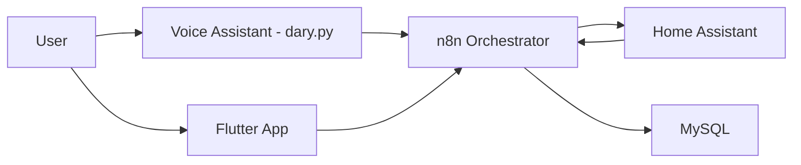
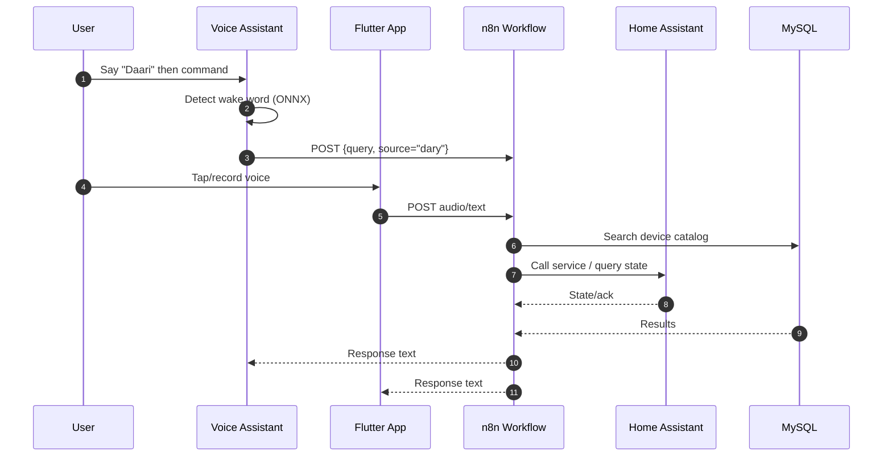

# Dary - Smart Home Voice Assistant

A comprehensive smart home automation system featuring custom wake word detection, voice control, and AI-powered device management through N8N workflows and Home Assistant integration.

## 🏠 Overview

Dary is a voice-controlled smart home assistant that combines:
- **Custom wake word detection** using ONNX models
- **Speech-to-text** via ElevenLabs Scribe API
- **AI-powered device control** through N8N workflows
- **Home Assistant integration** for smart device management
- **Bilingual support** (English/Arabic) with Egyptian Arabic responses

## 🎯 Features

### Voice Control
- Custom wake word: "Daari" (Arabic for "my home")
- Real-time speech recognition with ElevenLabs Scribe
- Voice Activity Detection (VAD) for accurate command capture
- Text-to-speech responses (configurable)

### Smart Home Integration
- Home Assistant device discovery and control
- AI-powered intent recognition for device commands
- Support for lights, media players, climate control, and more
- Bilingual device catalog with Arabic translations
- Real-time device state monitoring and caching

### N8N Workflow Automation
- **Multi-Agent Architecture**: 7 specialized AI agents for different tasks
- **Intelligent Routing**: Smart classification and routing of requests
- **Device State Management**: Real-time device information and service calls
- **MySQL Database**: Full-text search with bilingual keyword support
- **Session Memory**: Context-aware conversations with memory persistence
- **Webhook Integration**: Seamless communication with voice interface
- **Scheduled Updates**: Automatic device catalog synchronization

## 📁 Project Structure

```
home-voice-assistant/
├── dary.py               # Desktop voice assistant (Python)
├── workflowN8N.json      # N8N workflow configuration
├── mobile/               # Flutter mobile app (Android/iOS/web/desktop)
│  ├── lib/               # Flutter source (Dart)
│  ├── android/           # Android project
│  ├── ios/               # iOS project
│  ├── web/               # Web build target
│  ├── macos/, windows/, linux/  # Desktop targets
│  └── README.md          # Mobile app README
├── .env                  # Environment configuration (create this)
└── README.md             # This file
```

## 📱 Mobile App

The repository now includes a Flutter-based mobile app under `mobile/` that works alongside the voice assistant:

- **Remote control** for Home Assistant devices
- **Moments/Scenes** quick actions
- **Voice chat with Dary** using the same N8N backend
- Cross-platform: Android, iOS, Web, and desktop

## 🧭 System Architecture

### Context (C4 - Level 1)



### Containers (C4 - Level 2)



### Voice Flow (Desktop Assistant)

1. Wake word detected (OpenWakeWord ONNX)
2. Capture utterance with VAD, transcribe via ElevenLabs Scribe
3. POST JSON to n8n webhook with `query` and `source="dary"`
4. n8n routes to agents, queries device catalog (MySQL), calls Home Assistant
5. n8n returns response text; assistant optionally plays TTS

### Mobile Flow (Future Wiring)

1. Record audio (Flutter `record`)
2. Send audio or text to the same n8n webhook (configurable)
3. Receive response and display in UI

### Configuration Surface

- Wake model path: `WAKEWORD_MODEL_PATH` or `WAKEWORD_MODEL_DIR` + `WAKEWORD_MODEL_FILENAME`
- Audio devices: `INPUT_DEVICE`, `OUTPUT_DEVICE`
- ElevenLabs: `ELEVENLABS_API_KEY`, `VOICE_ID`
- Webhook: `WEBHOOK_URL` (desktop), app config for mobile

### Mobile App: Quick Start

Prerequisites:
- Flutter SDK (3.24+ recommended)
- Android Studio / Xcode for platform tooling
- A running N8N instance and Home Assistant (same as backend requirements below)

Commands:
```bash
cd mobile
flutter pub get
flutter run  # choose device/emulator
```

Configuration:
- Update any environment/base URLs inside the app as needed (e.g., N8N webhook or API base). See `lib/` screens such as `talk_with_dary.dart` for where the app posts voice/text to your backend.

## 🚀 Quick Start

### Prerequisites

- Python 3.8+
- MySQL database
- Home Assistant instance
- N8N instance
- ElevenLabs API account
- Custom wake word model (ONNX)

### Installation

1. **Clone and setup Python environment:**
```bash
cd dartech
python3 -m venv venv
source venv/bin/activate  # On Windows: venv\Scripts\activate
pip install sounddevice webrtcvad numpy requests pydub python-dotenv onnxruntime
```

2. **Install OpenWakeWord from GitHub:**
```bash
pip install --no-cache-dir --no-deps "openwakeword @ git+https://github.com/dscripka/openWakeWord.git@main"
```

3. **Install system dependencies:**
```bash
# Ubuntu/Debian
sudo apt install ffmpeg

# macOS
brew install ffmpeg
```

4. **Create environment configuration:**
```bash
cp .env.example .env
# Edit .env with your API keys and settings
```

### Configuration

Create a `.env` file in the project root:

```env
# ElevenLabs API Configuration
ELEVENLABS_API_KEY=sk_your_api_key_here
VOICE_ID=21m00Tcm4TlvDq8ikWAM
WEBHOOK_URL=https://your-n8n-instance.com/webhook/469998e4-fcd2-4b66-a094-b7df3e6c6119

# Language Settings
LANGUAGE_CODE=auto  # or "en"/"eng" for English, "auto" for auto-detect

# Audio Device Configuration (optional)
INPUT_DEVICE=2      # Microphone device index or name
OUTPUT_DEVICE=5     # Speaker device index or name

# Wake Word Sensitivity (optional)
WAKE_THRESHOLD=0.1  # Lower = more sensitive
REQUIRED_HITS=1     # Consecutive frames needed to trigger

# Wake Word Model (choose one of A or B)
# A) Explicit path to your ONNX wake word model
WAKEWORD_MODEL_PATH=/absolute/path/to/your/model.onnx
# B) Directory + filename
WAKEWORD_MODEL_DIR=/absolute/path/to/your/model/dir
WAKEWORD_MODEL_FILENAME=model.onnx
# Legacy (still supported):
# WAKEWORD_MODEL=/absolute/path/to/your/model.onnx
```

### Wake Word Model

Place your ONNX wake word model in a location you choose and configure either:
- `WAKEWORD_MODEL_PATH` to the explicit model file path, or
- `WAKEWORD_MODEL_DIR` plus `WAKEWORD_MODEL_FILENAME` to the containing directory and file name.

Note: The legacy variable `WAKEWORD_MODEL` is still supported for backward compatibility.

The model should be trained to recognize "Daari" (Arabic pronunciation).

## 🎮 Usage

### Starting the Voice Assistant

```bash
python dary.py
```

The system will:
1. Load the custom wake word model
2. Start listening for "Daari"
3. When detected, capture your voice command
4. Transcribe using ElevenLabs Scribe
5. Send to N8N webhook for processing
6. Execute Home Assistant commands
7. Return to listening mode

### Voice Commands

**Device Control:**
- "Turn on the living room lights"
- "Set the temperature to 22 degrees"
- "Play music on the TV"
- "Open the garage door"

**Device Inquiries:**
- "What's the current temperature?"
- "Is the TV on?"
- "What channel is playing?"

**Bilingual Support:**
- Commands work in both English and Arabic
- Responses in Egyptian Arabic when appropriate

## 🔧 N8N Workflow Setup

### Import Workflow

1. Open your N8N instance
2. Import `workflowN8N.json`
3. Configure the following credentials:
   - **OpenAI API**: For AI agents (multiple models: gpt-4.1-nano, gpt-5-nano, gpt-4.1-mini)
   - **MySQL Database**: For device catalog and search
   - **Home Assistant API**: For device control and state queries

### Workflow Architecture

The N8N workflow is a sophisticated multi-agent system with the following components:

#### Core Flow
1. **Webhook Trigger** (`469998e4-fcd2-4b66-a094-b7df3e6c6119`): Receives voice commands from Dary
2. **Intent Classification** (AI Agent3): Determines request type (control/inquiry/general)
3. **Device Discovery**: Searches MySQL catalog using full-text search
4. **Smart Routing**: Routes to appropriate AI agents based on intent
5. **Response Generation**: Creates contextual responses in Arabic/English

#### AI Agents
- **AI Agent3**: Intent classifier (control/inquiry/general)
- **AI Agent1**: Device selector - chooses optimal device from catalog
- **AI Agent**: Command processor - generates Home Assistant service calls
- **AI Agent4**: General conversation handler
- **AI Agent5**: Control confirmation responses
- **AI Agent6**: Device inquiry responses
- **AI Agent2**: Device catalog processor (bilingual keyword extraction)

#### Device Management
- **Schedule Trigger**: Periodic device catalog updates
- **Home Assistant Integration**: Fetches all states and services
- **MySQL Database**: Stores device catalog with bilingual keywords
- **Full-text Search**: Natural language device matching

#### Memory & Context
- **Session Memory**: Maintains conversation context per source
- **Device State Caching**: Real-time device information
- **Bilingual Support**: Arabic/English keyword processing

### Database Schema

The workflow expects a MySQL table `ha_devices`:

```sql
CREATE TABLE ha_devices (
    entity_id VARCHAR(255) PRIMARY KEY,
    name VARCHAR(255),
    keywords TEXT,
    info JSON,
    updated_at TIMESTAMP DEFAULT CURRENT_TIMESTAMP ON UPDATE CURRENT_TIMESTAMP,
    FULLTEXT(name, keywords)
);
```

### Advanced Workflow Features

#### Bilingual Keyword Processing
The workflow automatically processes device information to create bilingual search keywords:
- **English terms**: light, switch, sensor, media player, etc.
- **Arabic equivalents**: ضوء, مفتاح, مستشعر, مشغل وسائط, etc.
- **Room translations**: living room → غرفة المعيشة, bedroom → غرفة النوم

#### Smart Device Matching
- **Full-text search** using MySQL's natural language mode
- **Fuzzy matching** with fallback to LIKE queries
- **Context-aware selection** (e.g., channel queries focus on TV entities)
- **Entity ID validation** and error handling

#### Multi-Model AI Architecture
- **GPT-4.1-nano**: Fast intent classification and device selection
- **GPT-5-nano**: Advanced device catalog processing
- **GPT-4.1-mini**: Conversational responses and confirmations

#### Session Management
- **Memory buffers** maintain conversation context per source
- **Session keys** based on request source (e.g., "dary" for voice interface)
- **Contextual responses** that remember previous interactions

## 🏠 Home Assistant Integration

### Required Configuration

1. **Long-lived Access Token**: Generate in Home Assistant profile
2. **API Endpoint**: `http://your-ha-instance:8123/api/`
3. **Service Discovery**: Ensure all devices are properly exposed

### Supported Device Types

- **Lights**: On/off, brightness, color, effects
- **Media Players**: Play/pause, volume, source selection
- **Climate**: Temperature, mode, fan settings
- **Covers**: Open/close, position control
- **Switches**: On/off, toggle
- **Locks**: Lock/unlock
- **Fans**: Speed control, oscillation
- **Sensors**: State inquiries

## 🎛️ Audio Configuration

### Finding Audio Devices

```bash
python -c "import sounddevice as sd; print(sd.query_devices())"
```

### Device Selection

- Use device index numbers or exact names
- Test with: `python -c "import sounddevice as sd; sd.default.device = (2, 5); print('Input:', sd.default.device[0], 'Output:', sd.default.device[1])"`

## 🔍 Troubleshooting

### Common Issues

1. **Wake word not detected:**
   - Check `WAKEWORD_MODEL_PATH` or `WAKEWORD_MODEL_DIR` + `WAKEWORD_MODEL_FILENAME` in `.env`
   - Adjust `WAKE_THRESHOLD` in `.env`
   - Verify microphone permissions

2. **Audio device errors:**
   - List available devices: `python -c "import sounddevice as sd; print(sd.query_devices())"`
   - Set correct device indices in `.env`

3. **N8N workflow errors:**
   - Verify webhook URL in `.env`
   - Check N8N credentials configuration
   - Ensure MySQL database is accessible

4. **Home Assistant connection issues:**
   - Verify API token and URL
   - Check Home Assistant logs
   - Ensure devices are properly configured

### Debug Mode

Enable detailed logging by modifying the logging level in `dary.py`:

```python
logging.basicConfig(level=logging.DEBUG, ...)
```

## 🔒 Security Considerations

- Store API keys securely in `.env` file
- Use HTTPS for webhook URLs in production
- Regularly rotate API keys
- Monitor Home Assistant access logs
- Consider network isolation for IoT devices

## 🤝 Contributing

1. Fork the repository
2. Create a feature branch
3. Make your changes
4. Test thoroughly
5. Submit a pull request


## 🙏 Acknowledgments

- [OpenWakeWord](https://github.com/dscripka/openWakeWord) for wake word detection
- [ElevenLabs](https://elevenlabs.io/) for speech services
- [N8N](https://n8n.io/) for workflow automation
- [Home Assistant](https://www.home-assistant.io/) for smart home integration

---

**Note**: This system processes voice data and controls smart home devices. Ensure you have proper permissions and follow local privacy regulations when deploying.
